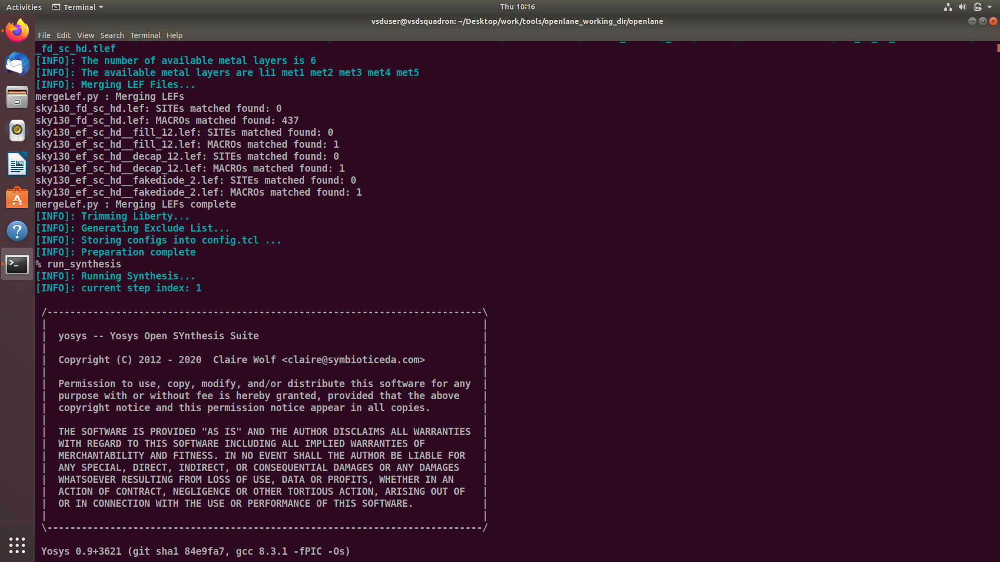
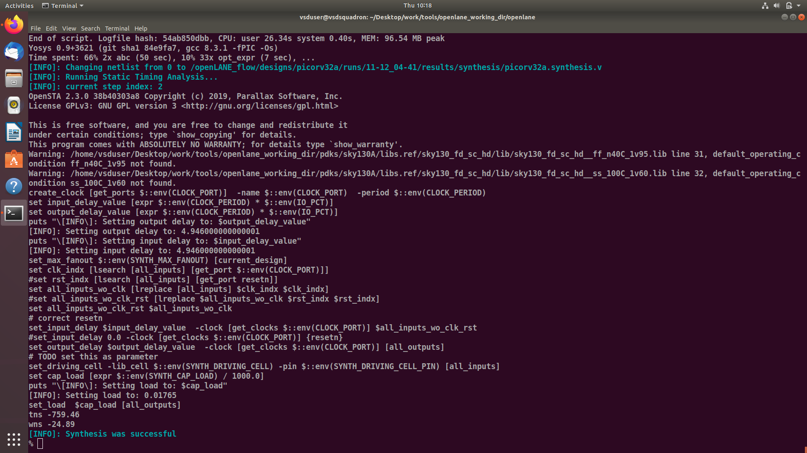
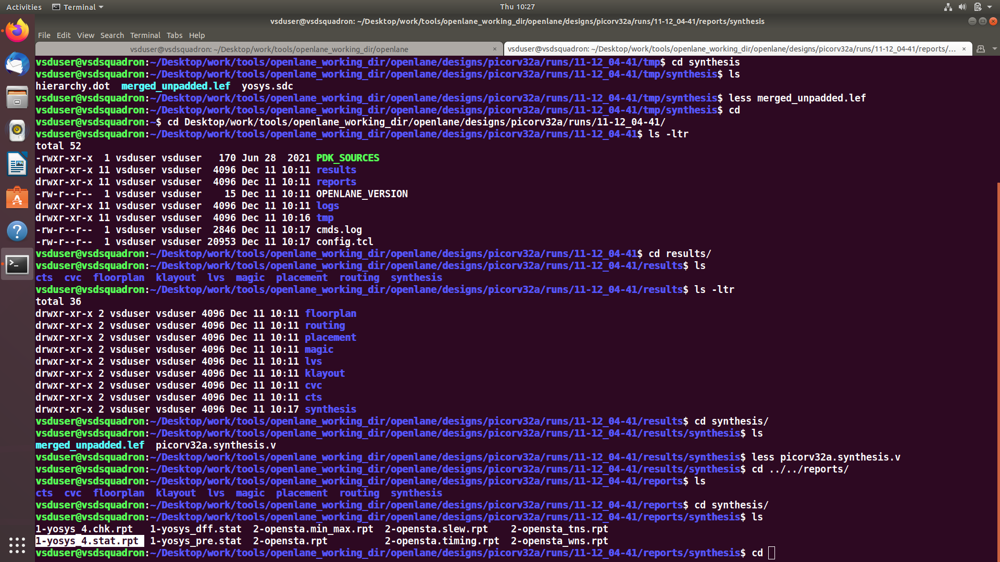
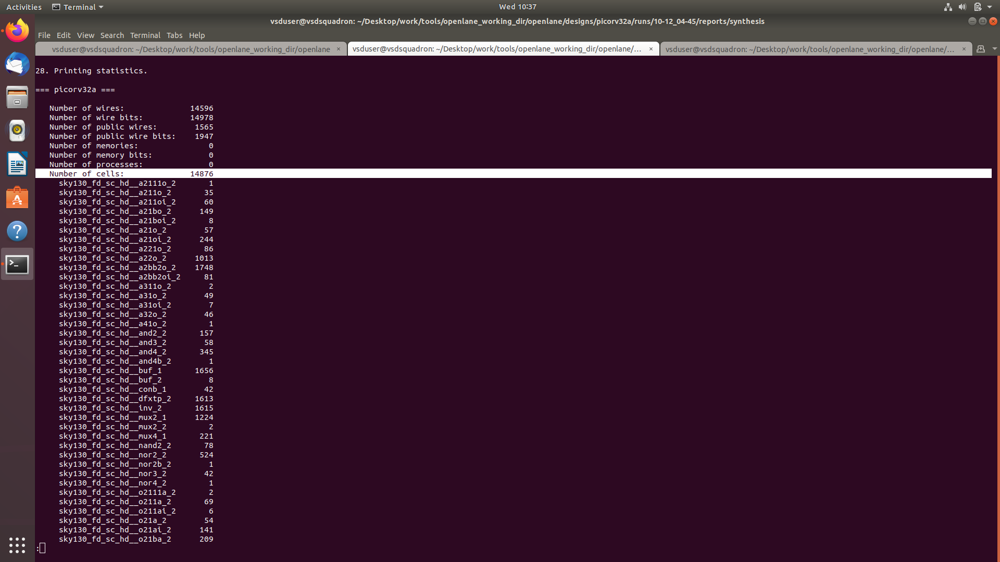

# Day 1


## Theory


Introduction to ASIC design flow and its fundamental elements:


- Package 
- Die 
- Core 
- IPs 
- Overview of the complete RTL → GDSII flow 


---


## Lab


### **a) Synthesis of PicoRV32A**

Inside the OpenLANE interactive window, the synthesis step was performed:
```
$ run_synthesis
```
This command executes Yosys + ABC to generate the synthesized netlist and cell statistics in the **run/** folder.


#### I) Screenshot for run_synthesis cmd



#### II) Screenshot of the files that is being generate after run_synthesis



### **b) Calculation for D flipflop ratio**


The synthesis report provides two key values:

   - Total number of cells in the design
   - Total number of D flip-flops (DFFs)

These values are used to compute the Flip-Flop Ratio, which indicates the percentage of sequential elements in the synthesized design.

#### Formula
   ``` 
   Flop Ratio = (Number of DFFs) / (Total Number of Cells) 

   ```

From the synthesis report:

- Number of DFFs = 1613
- Total number of cells = 14676

```
Flop Ratio = 1613 / 14676 ≈ 0.1084
Flip-Flop Ratio ≈ 0.1084 (or 10.84%)
```
#### Screenshot of synthesis report

***Total number of cells***


***Total number of flip flops***


---


