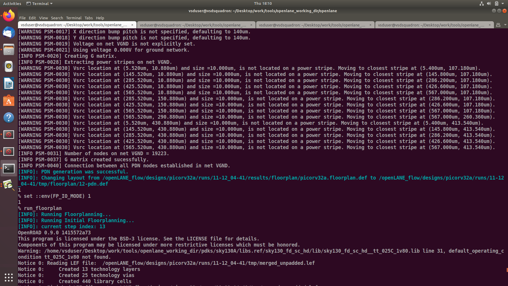
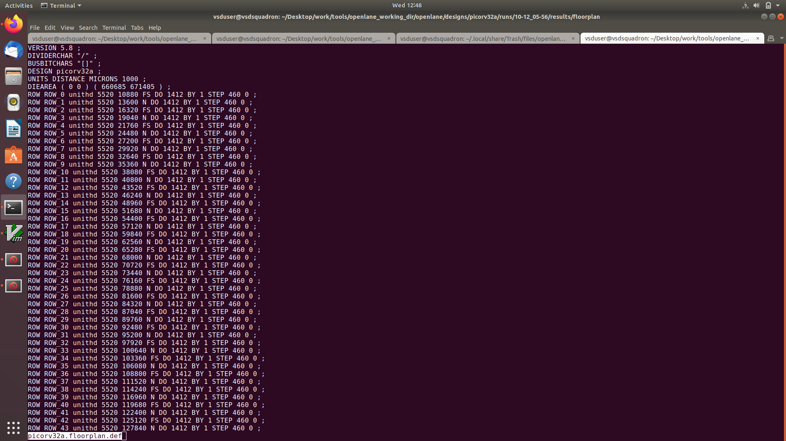
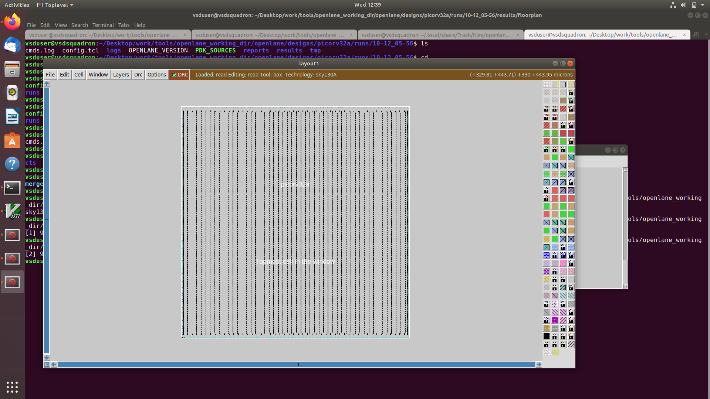
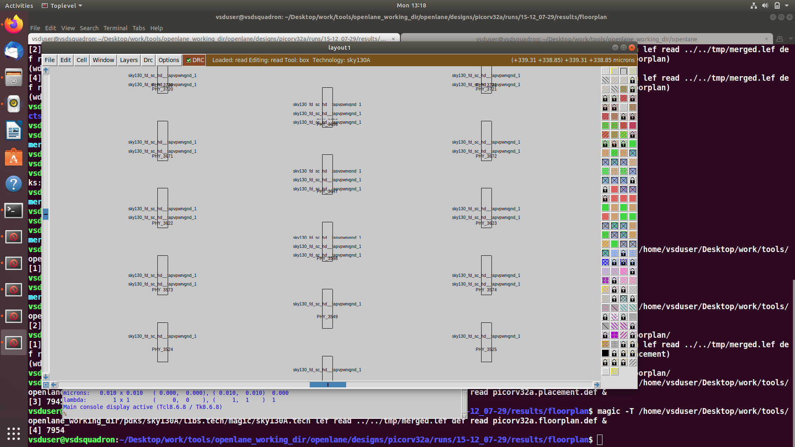
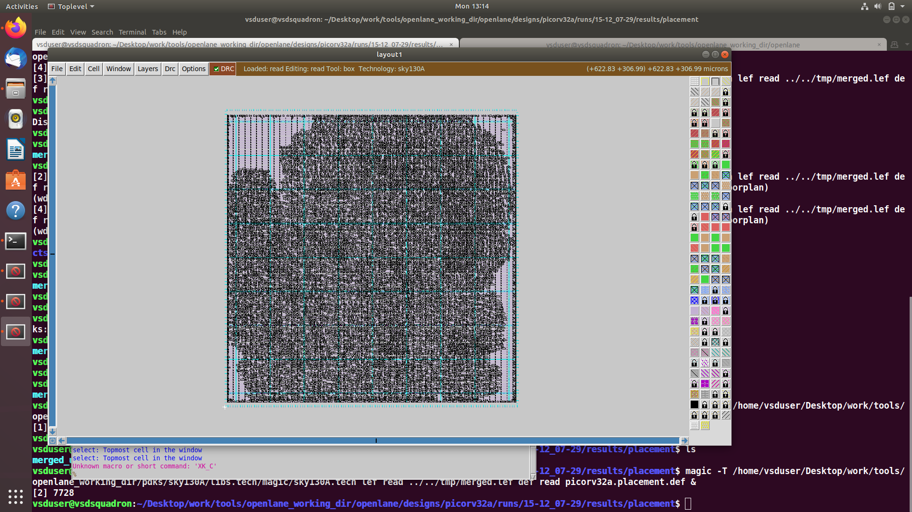

# Day 2


## Lab


### **A) Run floorplan for picorv32**

Before all running floorplan we need to start with the setup commands and run_synthesis which is given in the day1.

#### Set the mode inside the openlane
```
% run_floorplan

```



### B) Calculate the die area in microns from the values in floorplan def

run_floorplan will geneate a file name "picorv32a.floorplan.def"




```
DIEAREA ( 0 0 ) ( 660685 671405 )
1000 DEF units = 1 micron
So actual dimensions in microns are: 
Width = 660685 / 1000 = 660.685 µm 
Height = 671405 / 1000 = 671.405 µm 
Die Area = Width × Height = 660.685 × 671.405 ≈ 443,508.7 µm²

```

### C) Load generated floorplan def in magic tool and explore the floorplan.

To open the floorplan of our design. we need to open our floorplan dir of our current design.
```
# Change directory to path containing generated floorplan def
cd Desktop/work/tools/openlane_working_dir/openlane/designs/picorv32a/runs/10-12_05-56/results/floorplan/

# Command to load the floorplan def in magic tool
magic -T /home/vsduser/Desktop/work/tools/openlane_working_dir/pdks/sky130A/libs.tech/magic/sky130A.tech lef read ../../tmp/merged.lef def read picorv32a.floorplan.def &

```




### D) Run 'picorv32a' design placement using OpenLANE flow.

```
% run_placement
```


### E) Load generated placement def in magic tool.
Again using the same commands but with the placement of cell in the design.

```
# Change directory to path containing generated floorplan def
cd Desktop/work/tools/openlane_working_dir/openlane/designs/picorv32a/runs/10-12_05-56/results/floorplan/

# Command to load the floorplan def in magic tool
magic -T /home/vsduser/Desktop/work/tools/openlane_working_dir/pdks/sky130A/libs.tech/magic/sky130A.tech lef read ../../tmp/merged.lef def read picorv32a.placement.def &


```


----
