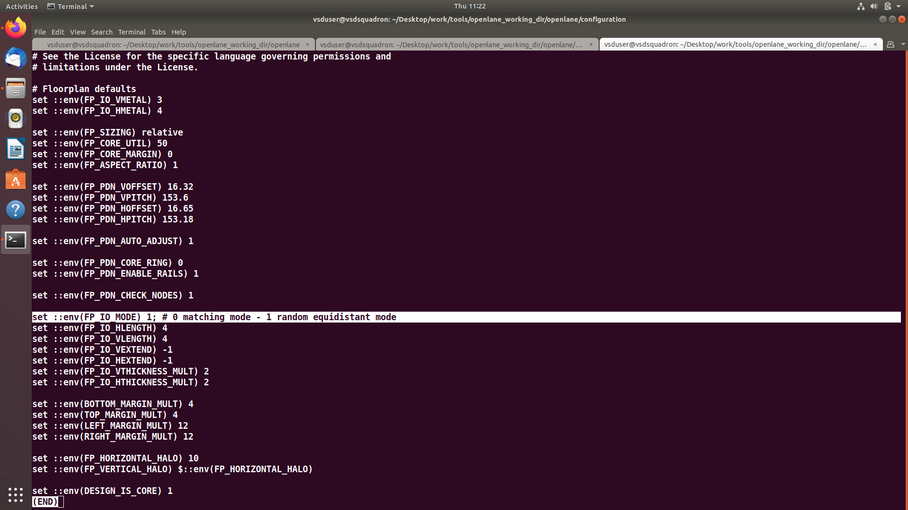
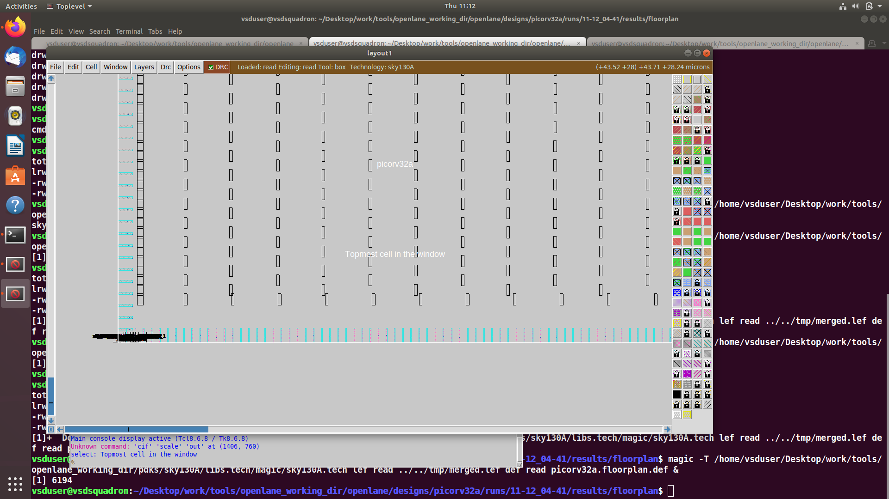
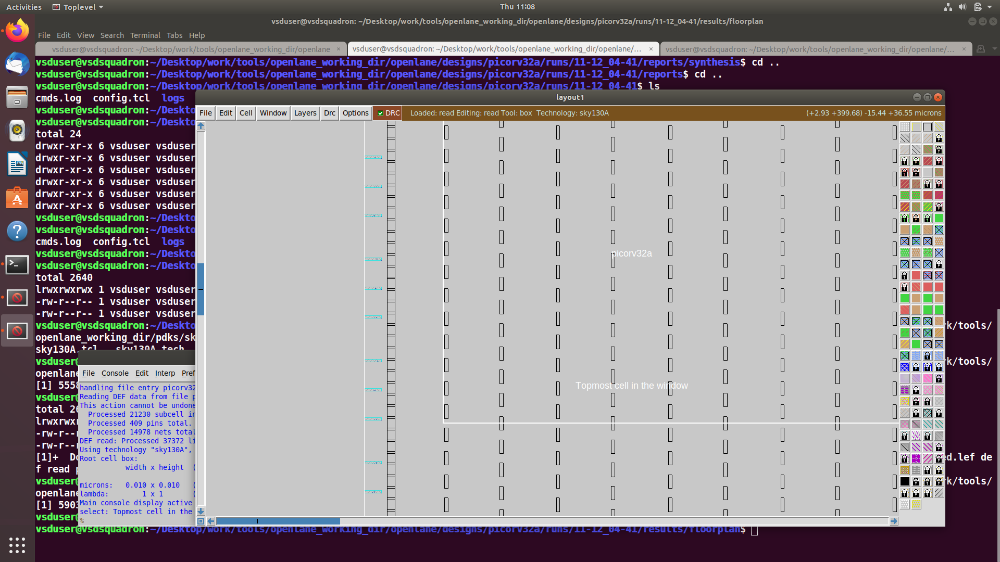
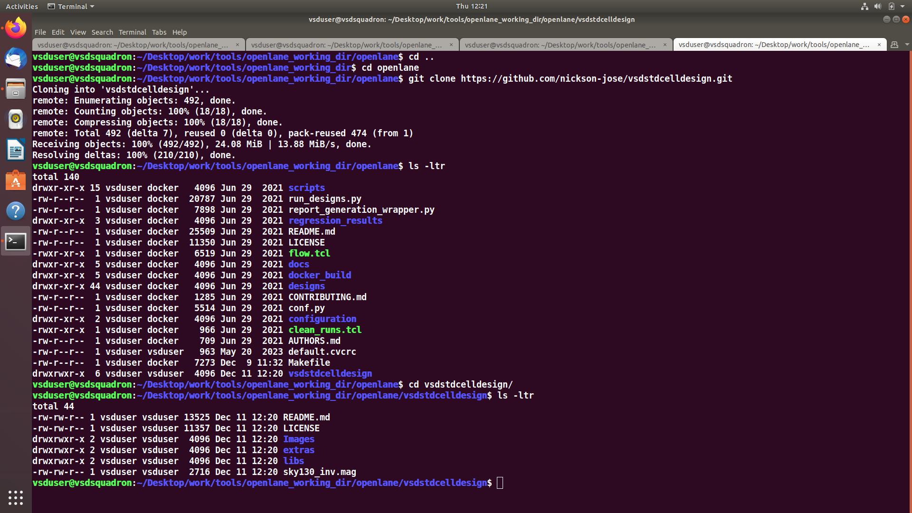
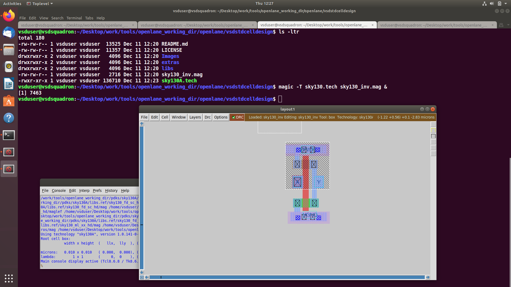
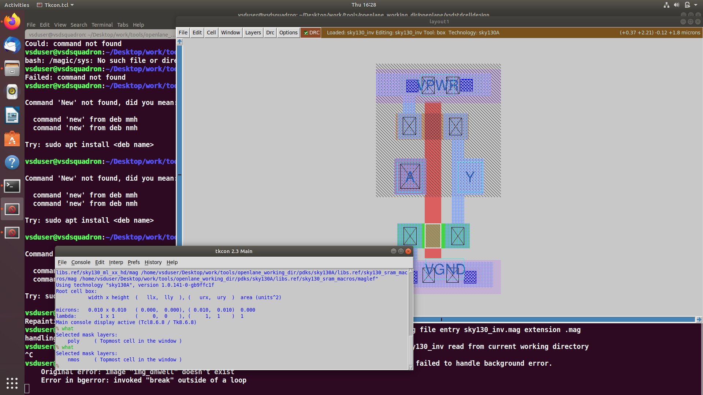
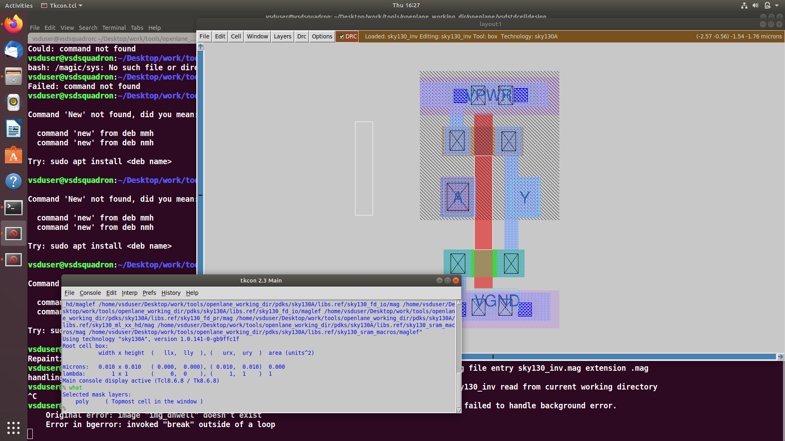

# Day 3


## Lab


### **A) Changing the IO Placer Mode and Re-running Floorplan**

#### IO Placement Modes

* **Equidistant IO Placement (FP_IO_MODE = 1)** Pins are placed randomly but equally spaced along the die boundary (Default mode).
* **Matching / Non-Equidistant IO Placement (FP_IO_MODE = 0)**
      * Pins are grouped or placed based on connectivity or matching rules. Spacing between pins is not uniform.

#### Set the mode inside the openlane
```
% set ::env(FP_IO_MODE) 1

```


#### I) Screenshot for configuration file 


#### II) Screenshot for IO_MODE = 0


#### III) Screenshot for IO_MODE = 1


### B) Cloning the Standard Cell Design Repository 
To access the vsdstdcelldesign repository, the following git command is used:

```
git clone https://github.com/nickson-jose/vsdstdcelldesign.git
```
#### Screenshot of git clone


### C) Inspecting Layout Layers Using Magic
- To analyze the standard cell layout visually, the Magic layout file (sky130_inv.mag) must be opened using the correct Sky130 technology file (sky130A.tech).
- fter cloning the vsdstdcelldesign repository, you copy the required layout files into the directory, navigate into it, and launch Magic.
-  This allows you to view every layer of the standard cell—such as diffusion, poly, metal1–metal5, contacts, vias, wells, and implants—and turn layers on or off for detailed inspection of the physical layout.

```
# Copy the layout and tech file (if required)
cp sky130A.tech /home/vsduser/Desktop/work/tools/openlane_working_dir/openlane/vsdstdcelldesign

# Move into the directory
cd vsdstdcelldesign

# Launch Magic with Sky130 PDK
magic -T sky130A.tech sky130_inv.mag &
```

#### I) Screenshot of the layout of an inverter


#### II) Screenshot of the nmos in the layout


#### III) Screenshot of the ploysilicon



----


